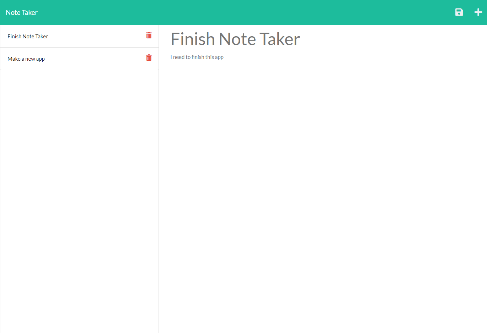

# Note Taker

This is a simple app to take notes and to save them for future reference.  You can click the button on the home page top get started.  Once a title and a note is added, you can click on the save button on the top right to save your notes.  Notes can be referenced on the left by clicking on them.  You can also click on the delete button to delete notes.

